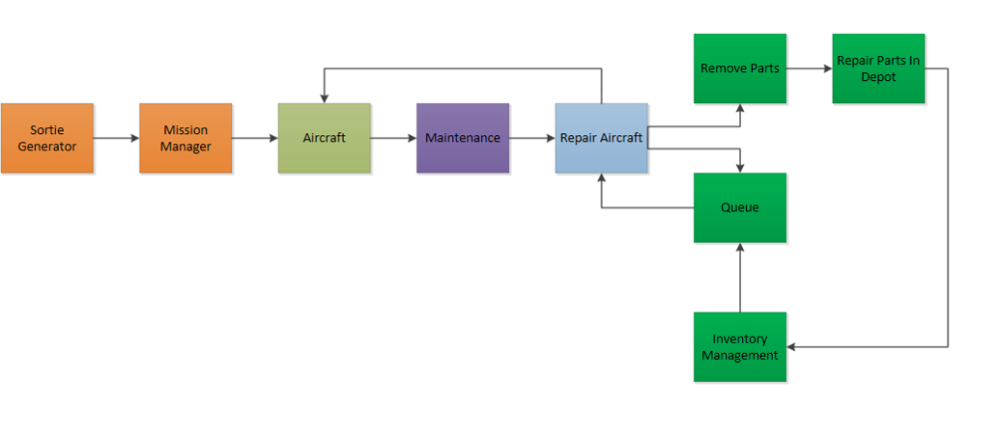
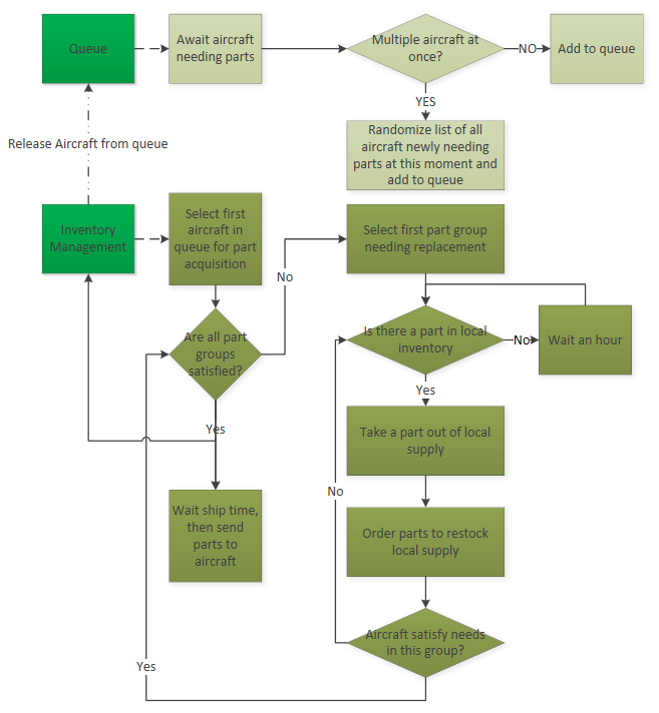
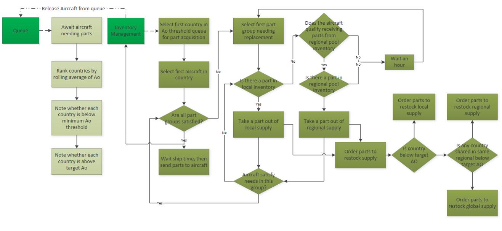
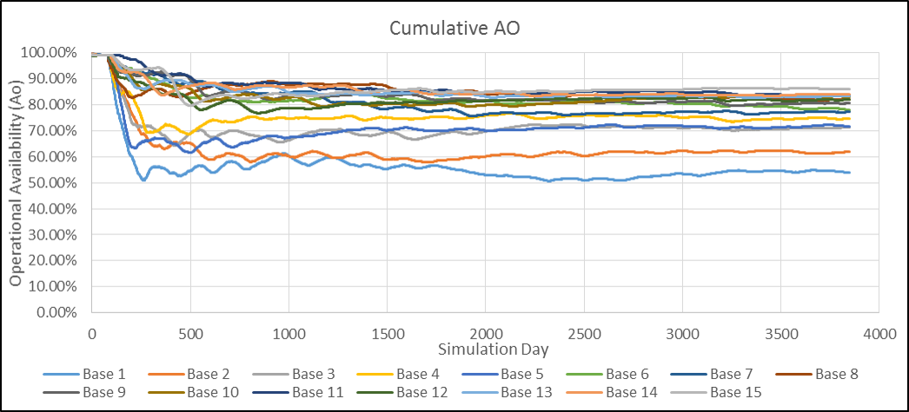
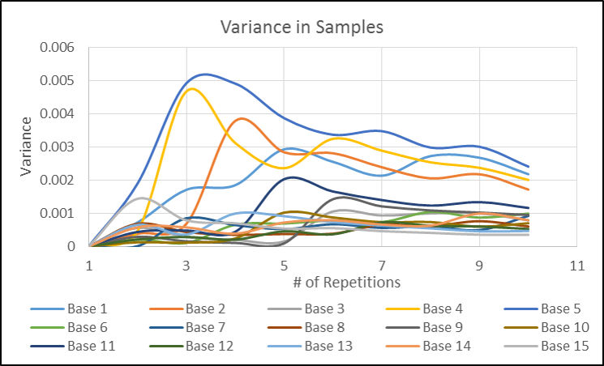
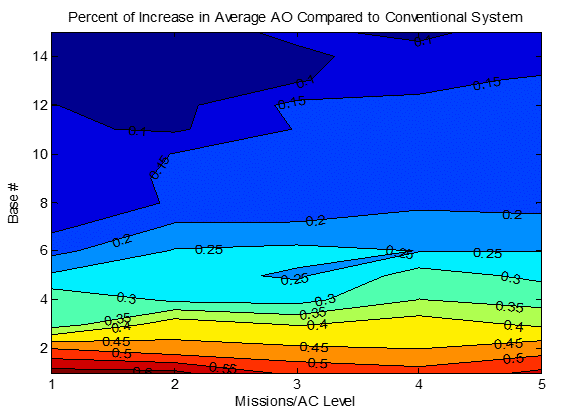
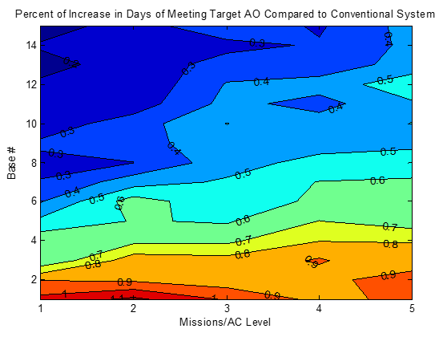

# Simulation Model for a Fleet Sustainment Study
A logistical and operational behavior simulation model of fighter fleets that is used 
to study a wider range of sustainment strategies. It tracks aircraft performance and inventory status. 
Users can choose particular dataset to output for his/her research interets

## Requirement
[SimPy](https://simpy.readthedocs.io/en/latest/) Package

## Components

**Physical components to model**
* High level Fleet Operation

* High leve Inventory Flow

**Python Classes**
* `class SortieGen(Process)` This process sets up sortie generation for each country
* `class AC(Process)` This process tells each aircraft what to do
* `class Queue(Process)` This process handles the creation of the queue and its management for aircraft that enter the queue concurrently
* `class Parts(Process)` This process handles the spare part cycle for each country
* `class inventory()`
* `class Training_Local_transit_time(Process)`
* `class Combat_Local_transit_time(Process)`
* `class Pool_transit_time(Process)`
* `class Send(Process)` This process sends parts to be repaired and is activated when needed and only run once
* `class OrderPT(Process)`
* `class OrderPC(Process)`
* `class OrderGP(Process)` This process requests parts from the pooled inventory and is activated when needed and only run once
* `class Daily(Process)` This process records quantities daily to be output as time series data

## Study Result Examples

